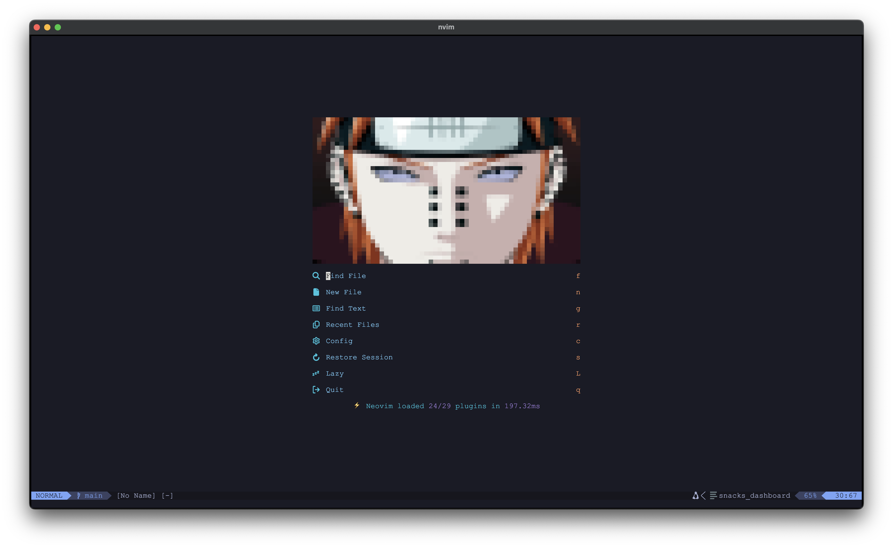
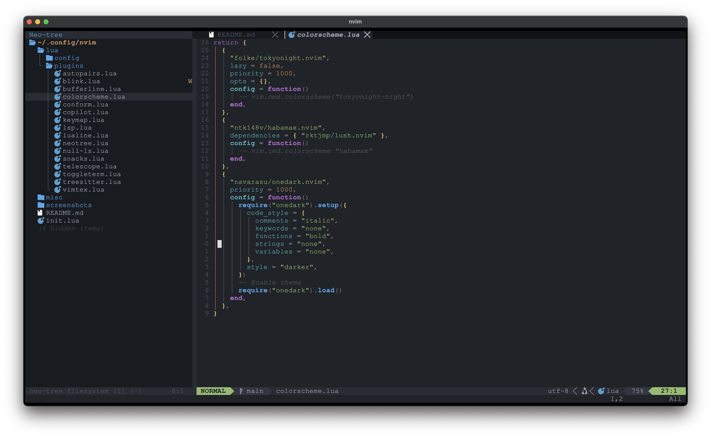
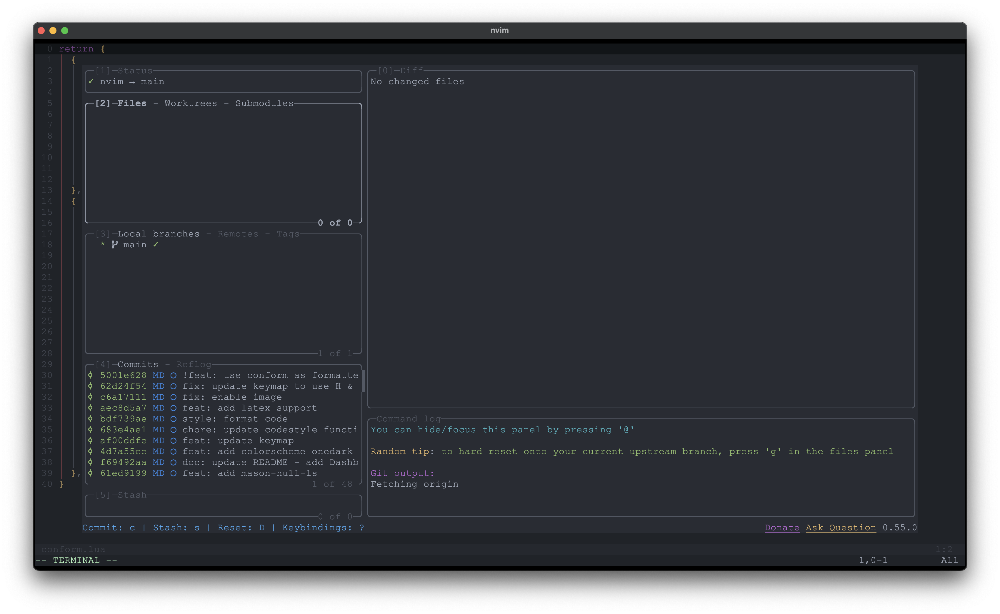

# My neovim configuration

Plugin manager: Lazy

## Requirements

Some requirements can be installed via a package manager. I use brew on MacOS,
but it should work with Linux package managers as well. Other requirements
have to be downloaded otherwise.

### Requirements via package manager

- Neovim
- Git
- Lazygit
- Tree-sitter-cli
- A C compiler
- curl
- tar
- fd
- ripgrep
- a terminal that support true color and undercurl (I use kitty in MacOS;
  ghostty can be used for Windows)
- NodeJS
- latexmk
- php
- ruby
- python
- texlive-bin
- wget

### Other Requirements

- [A Nerd Font](https://www.nerdfonts.com)

## Plugins

- Colorschemes: tokyonight, habamax
- Highlighting: treesitter
- LSP: mason, nvim-lspconfig, mason-lspconfig
- Terminal: toggleterm
- Keymap: which-key
- Completion: blink.cmp, autopairs
- Fileexplorer: neotree
- Dashboard: snacks
- Styling: lualine, bufferline
- Formatting: conform

## Handy Keymap

- space: Leader key, show keymap
- H / L: Switch buffers to previous / next one
- F4: Toggle terminal

## Screenshots

### Dashboard

### Editor

### Lazygit integration

